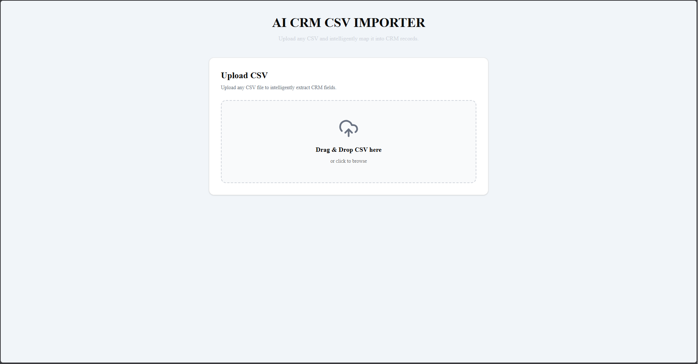
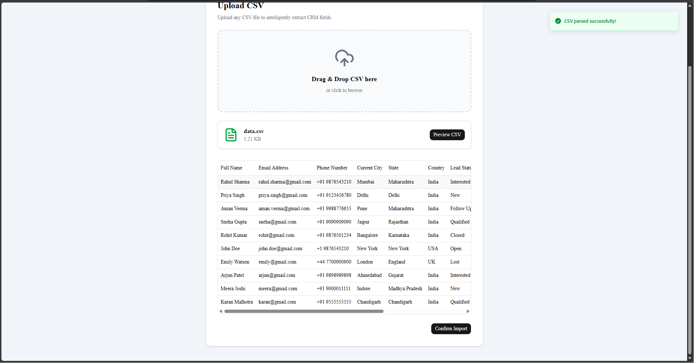
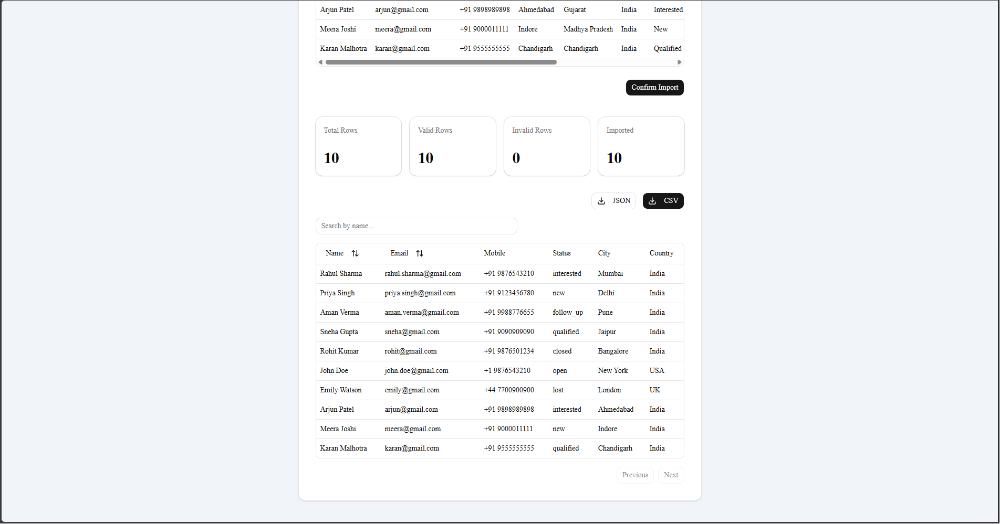

# 🤖 AI CRM CSV Importer

An AI-powered CSV Importer that intelligently maps arbitrary CSV files into a standardized CRM schema using **Google Gemini**, **Next.js**, **Express.js**, and **TypeScript**.

Built as a technical assignment for GrowEasy AI.

---

## ✨ Features

- 📁 Drag & Drop CSV Upload
- 👀 CSV Preview before import
- 🤖 AI-powered CRM field mapping
- 📊 Import Statistics Dashboard
- ✅ Data Validation
- 🔄 Batch Processing
- 📱 Responsive UI
- ⚡ Fast CSV Parsing
- 🛡 Error Handling

---

## 🏗 Tech Stack

### Frontend

- Next.js 15
- TypeScript
- Tailwind CSS
- shadcn/ui
- React Dropzone
- PapaParse
- Axios

### Backend

- Express.js
- TypeScript
- Multer
- PapaParse
- Google Gemini API
- Zod

---

## 📂 Project Structure

```
groweasy-ai-importer/

├── frontend/
│   ├── src/
│   │   ├── app/
│   │   ├── components/
│   │   ├── services/
│   │   ├── types/
│   │   └── utils/
│
├── backend/
│   ├── src/
│   │   ├── controllers/
│   │   ├── routes/
│   │   ├── services/
│   │   ├── middleware/
│   │   ├── prompts/
│   │   ├── utils/
│   │   └── types/
│
└── README.md
```

---

# 🚀 Application Flow

```
Upload CSV

      │

      ▼

Preview CSV

      │

      ▼

Confirm Import

      │

      ▼

Backend Upload

      │

      ▼

CSV Parsing

      │

      ▼

Validation

      │

      ▼

Batch Processing

      │

      ▼

Gemini AI

      │

      ▼

CRM Mapping

      │

      ▼

Result Table
```

---

# 🤖 AI Processing Pipeline

```
CSV

↓

Parse CSV

↓

Validate Records

↓

Create Batches (20 rows)

↓

Generate AI Prompt

↓

Gemini 2.5 Flash

↓

Structured CRM Records

↓

Merge Results

↓

Return Response
```

---

# 📦 Installation

## Clone Repository

```bash
git clone https://github.com/yourusername/groweasy-ai-importer.git

cd groweasy-ai-importer
```

---

## Frontend

```bash
cd frontend

npm install

npm run dev
```

Runs on

```
http://localhost:3000
```

---

## Backend

```bash
cd backend

npm install

npm run dev
```

Runs on

```
http://localhost:5000
```

# ⚡ Quick Start

```bash
git clone https://github.com/yourusername/groweasy-ai-importer.git

cd groweasy-ai-importer

docker compose up --build
```

Open:

- Frontend → http://localhost:3000
- Backend → http://localhost:5000

---

# 🔑 Environment Variables

Backend `.env`

```env
PORT=5000

GEMINI_API_KEY=YOUR_API_KEY
```

Frontend `.env.local`

```env
NEXT_PUBLIC_API_URL=http://localhost:5000/api
```

---

# 📡 API

## POST /api/import

Uploads CSV file and returns AI-processed CRM records.

### Request

```
multipart/form-data
```

Field

```
file
```

### Response

```json
{
  "success": true,
  "message": "CSV imported successfully",
  "stats": {
    "totalRows": 250,
    "validRows": 245,
    "invalidRows": 5,
    "importedRows": 245
  },
  "data": []
}
```

---

# 📊 CRM Fields

The AI extracts the following standardized fields:

- created_at
- name
- email
- country_code
- mobile
- city
- state
- country
- lead_owner
- crm_status
- crm_note
- data_source
- possession_time
- description

---

# 📸 Screenshots

### Upload CSV



---

### CSV Preview



---

### AI Processed Result




---

# 👨‍💻 Author

**Navneet Shahi**

GitHub: https://github.com/navneetshahi14

LinkedIn: https://www.linkedin.com/in/navneet-shahi-a8762824b/

---

# ⭐ If you like this project, give it a star!
